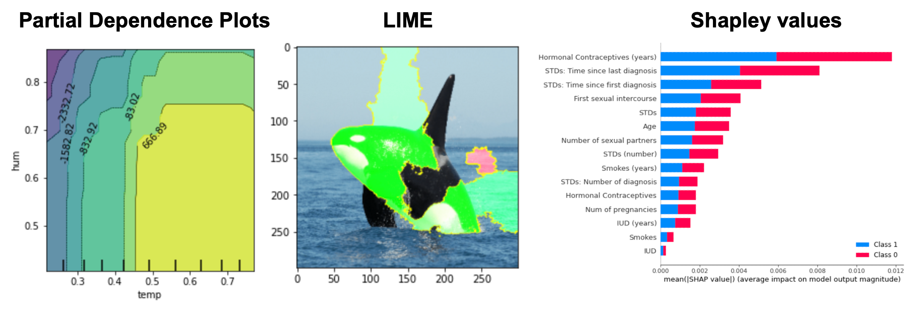

## Selected Projects

---

### Extraction of Single Repeating Pattern Unit

The algorithm mimics human perception by sliding images to detect periodicity. A reference image remains fixed while another slides, computing L2 loss across RGB channels. Average loss is calculated for overlapping regions, identifying midpoints. The distance between consecutive midpoints during ascent reveals the repeating pattern unit accurately.

<!---->

    
<a href="https://repeating-pattern-extractor.streamlit.app/">Try it now</a>

---

### Interpretable Machine Learning Model: Parital Dependence Plots, LIME and Shapley values

A significant barrier to ML's adoption in many fields is the lack of interpretability of black box models. In this project, I use several techniques to gain insights into various models. 

    

